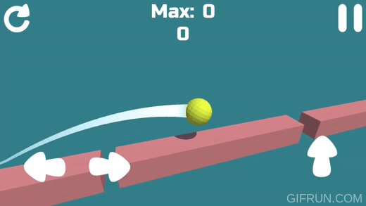
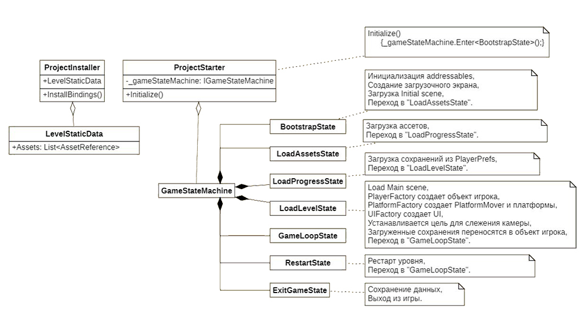
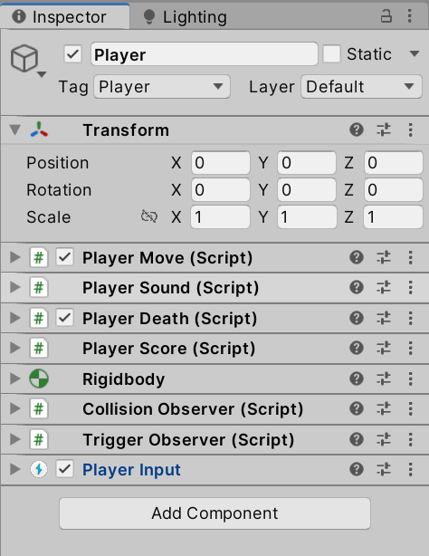
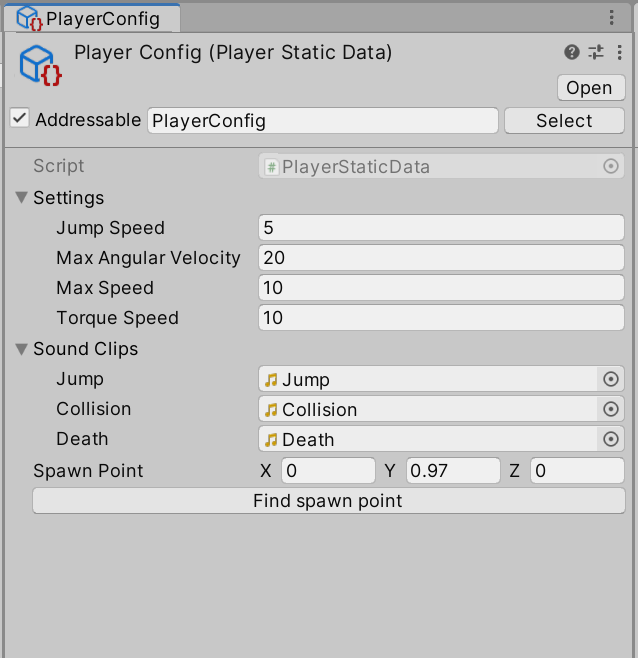
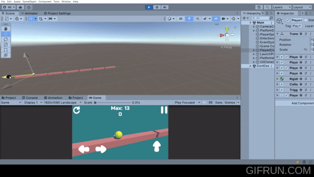
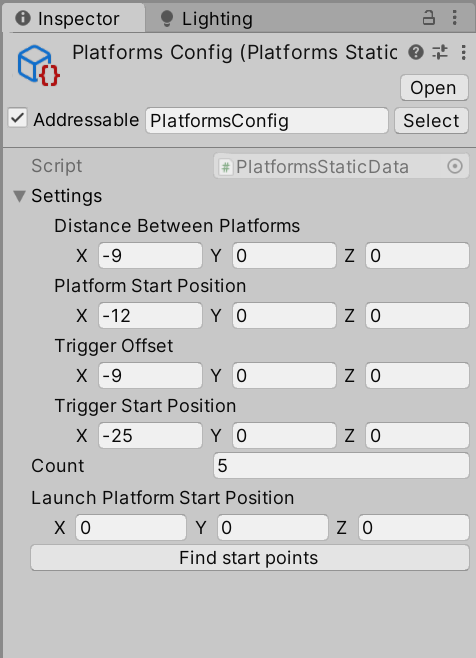

# Pet-project

**Описание:**
Игроку предстоит прыгать по платформам и удерживать равновесие.

**Цель игры:**
Набрать как можно больше очков.

## Реализация:
[Короткое видео](https://youtu.be/hNgIh3W-AME)

### Архитектура

* Жизненным циклом игры управляет класс `GameStateMachine`.
* Сервисы создаются и внедряются с помощью Zenject.
* В игре реализовано сохранение и загрузка очков из/в PlayerPrefs.

### Загрузка ассетов
Ассеты загружаются с помощью Addressables.

### Игрок

* Функционал игрока разделен по компонентам.
* Компоненты инициализируются через методы `Construct` в `PlayerFactory`.
* Передвижение игрока релизовано с использованием `Rigidbody`.
* Пользовательский ввод работает через Input System.
* Настройки персонажа загружаются из конфига игрока.

### Платформы

* За создание и инициализацию платформ отвечает `PlatformFactory`.
* Платформы контролируются скриптом `PlatformMover`. 
* Платформы перемещаются с начала в конец по достижению игроком триггера на платформе.
* Платформы не создаются каждый раз заново, а содержатся в пуле.
* Для управления перемещением платформ используется очередь `Queue<Platform>`.
* Настройки платформ загружаются из конфига.

### UI

* За создание и инициализацию UI отвечает `UIFactory`.
* Интерфейс создан с возможностью запуска на разных экранах (адаптивный).

-----
Моя цель при создания проекта заключалась в том, чтобы продемонстрировать свои профессиональные навыки в области разработки.
Поэтому я постарался реализовать полную архитектуру, несмотря на то, что это может показаться избыточным для такого небольшого проекта.

### Плагины, использованные в проекте:
* DOTween
* Zenject
* UniTask
* Addressables
* InputSystem
